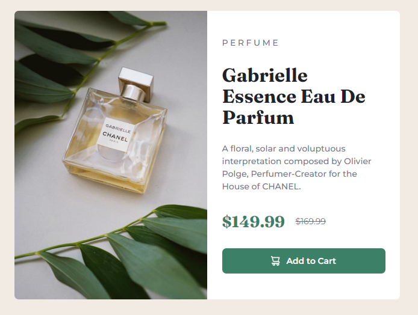

# Product Preview Component > [Visit Here](https://jenieg.github.io/product-preview-card-component/)

## Tech used:   

A responsive Product Preview Component made with semantic HTML, CCS3, with a heavy focus on Tailwind for styling.

## More Projects:

Take a look at these other projects I've done:

**Pantry to Plate:** https://github.com/jenieg/pantry-to-plate

**Guess that Pokemon:** https://github.com/jenieg/Guess-That-Pokemon
